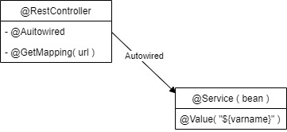

# Square Games Spring
Spring module exercise

### créer un projet Spring

ressources :
- initialiser un projet : [ https://start.spring.io]( https://start.spring.io)   
- [https://spring.io/guides/gs/spring-boot](https://spring.io/guides/gs/spring-boot)
- [https://www.postman.com/](https://www.postman.com/)    



### Annotations :

##### @Service, @Component, @Bean( "name" )
avant la déclaration de classe de composants auto instanciés

##### @Autowired

auto-instancie le composant ( ne jamais instancier manuellement new ...)

##### @Value

fournit une valeur de paramètre pour une auto-instanciation

##### @DependOn( "name" )
Pour attendre l'instanciation du bean "name" avant d'instancier le bean annoté

##### @RestController
Liste les endpoints

##### @PostMapping( "/url/*** ), @GetMapping( "/url/..")
mappe une url à une méthode du RestController

### Maven gestionnaire de dépendance

ajouter les dépendances souhaitées dans le fichier pom.xml   
pour game engine:
```xml
<dependency> 
    <groupId>fr.le_campus_numerique.square_games</groupId> 
    <artifactId>engine</artifactId> 
    <version>1.0-SNAPSHOT</version> 
</dependency> 
```
sans oublier d'ajouter le depot :
```xml
<repository> 
    <id>github</id> 
    <url>https://maven.pkg.github.com/le-campus-numerique/cda-java-spring-game engine</url> 
    <snapshots> 
        <enabled>true</enabled> 
    </snapshots> 
</repository> 
```
pour l'authentification Gitub il faut ajouter le fichier ~/.m2/settings.xml :
```xml
<settings xmlns="http://maven.apache.org/SETTINGS/1.0.0"
  xmlns:xsi="http://www.w3.org/2001/XMLSchema-instance"
  xsi:schemaLocation="http://maven.apache.org/SETTINGS/1.0.0
                      http://maven.apache.org/xsd/settings-1.0.0.xsd">

  <activeProfiles>
    <activeProfile>github</activeProfile>
  </activeProfiles>

  <profiles>
    <profile>
      <id>github</id>
      <repositories>
        <repository>
          <id>central</id>
          <url>https://repo1.maven.org/maven2</url>
        </repository>
        <repository>
          <id>github</id>
          <url>https://maven.pkg.github.com/le-campus-numerique/cda-java-spring-game-engine</url>

    <snapshots>
            <enabled>true</enabled>
          </snapshots>
        </repository>
      </repositories>
    </profile>
  </profiles>

  <servers>
    <server>
      <id>github</id>
      <username>PierreBoue</username>
      <password>[token généré par github]</password>
    </server>
  </servers>
</settings>
```
penser à raffraichir Maven

### Persitance

#### JPA

[https://openclassrooms.com/fr/courses/4668056-construisez-des-microservices/7652623-utilisez-jpa-pour-communiquer-avec-une-base-de-donnees#r-7667743](https://openclassrooms.com/fr/courses/4668056-construisez-des-microservices/7652623-utilisez-jpa-pour-communiquer-avec-une-base-de-donnees#r-7667743)

La classe à sauvegarder doit être annoté @Entity

````java
public class UserEntity implements UserDetails {
    @Id
    @GeneratedValue(strategy = GenerationType.AUTO)
    private Integer id;

    @ElementCollection(fetch = FetchType.EAGER)
    private List<String> authorities = new ArrayList<>();
    private String password;
    private String username;
    .....
    public Collection<? extends GrantedAuthority> getAuthorities()
    {
        return authorities.stream().map(s -> (GrantedAuthority) () -> s).collect(Collectors.toList());//AuthorityUtils.class( authorities );
    }

    public void addGrantedAuthoity( String gauth)
    {
        authorities.add(gauth);
    }

    public String getPassword()
    {
        return password;
    }
    .....
}

````
Il faut ensuite créer un repository pour contenir les entités

````java
@Component
public interface UserRepository  extends CrudRepository<UserEntity, Integer> {

    UserEntity findByUsername(String username);
    ....

}

````


Ajouter `@ServletComponentScan` avant `@SpringBootApplication`

faire un fichier Config SecurityConfig

```java
@Configuration
@EnableWebSecurity
@EnableMethodSecurity(securedEnabled = true)
public class SecurityConfig {
    private final MyUserDetailsService userDetailsService;
    @Autowired
    private JwtTokenAuthenticationFilter jwtTokenAuthenticationFilter;

    @Autowired
    AuthenticationConfiguration authenticationConfiguration;

    public SecurityConfig(final MyUserDetailsService userDetailsService) {

        this.userDetailsService = userDetailsService;
    }
    @Bean
    public SecurityFilterChain filterChain(HttpSecurity http) throws Exception
    {
        final AuthenticationManagerBuilder authenticationManagerBuilder =
                http.getSharedObject(AuthenticationManagerBuilder.class);
        authenticationManagerBuilder.userDetailsService(userDetailsService);
        final var authenticationManager = authenticationManagerBuilder.build();
        http.addFilterBefore( jwtTokenAuthenticationFilter, UsernamePasswordAuthenticationFilter.class);
        http.authenticationManager(authenticationManager);
// Activer CORS et désactiver
        http = http.cors().and().csrf().disable();
// Modifier le manager de session pour utiliser le mode STATELESS
        http = http

                .sessionManagement()
                .sessionCreationPolicy(SessionCreationPolicy.STATELESS)
                .and();

// Renvoyer un code d’erreur en cas d’accès non autorisé
        http = http

                .exceptionHandling()
                .authenticationEntryPoint(

                        (request, response, ex) -> {
                            response.sendError(

                                    HttpServletResponse.SC_UNAUTHORIZED,
                                    ex.getMessage()

                            );
                        }

                )
                .and();
        //.addFilterAfter( , AccessDeniedFilter.class)
                // Définir les autorisations d’accès aux ressources
                http.authorizeHttpRequests()

            // Les accès sans autorisation


                .requestMatchers("/api/public/**").permitAll()///**
                        //      .requestMatchers("/**").permitAll()///**
            // Les autres accès
           .anyRequest().authenticated()
                ;
                return http.build();
    }
    @Bean
    public PasswordEncoder passwordEncoder() {
        return new BCryptPasswordEncoder();
    }

    @Bean
    public AuthenticationManager authenticationManager() {
        try {
            return authenticationConfiguration.getAuthenticationManager();
        } catch (Exception e) {
            throw new RuntimeException(e);
        }
    }

}

```

### Logs

Dans le dossier ressource on créee logback.xml :

```xml
<configuration>
// Pattern de présentation du log
<appender name="CONSOLE" class="ch.qos.logback.core.ConsoleAppender">
<layout class="ch.qos.logback.classic.PatternLayout">
<Pattern>
%d{HH:mm:ss.SSS} [%t] %-5level %logger{36} - %msg%n
</Pattern>
</layout>
</appender>
// Niveau de journalisation personnalisé pour tous les packages “fr.”
<logger name="fr" level="debug" additivity="false">
<appender-ref ref="CONSOLE"/>
</logger>
<root level="error"> // Niveau de journalisation par défaut
<appender-ref ref="CONSOLE"/>
</root>
</configuration>
```

Dans une classe MaClasse on crée l'instance du logger :

```java
private static Logger LOGGER = LoggerFactory.getLogger(MaClasse.class);
```

On utilise ensuite le logger :
```java
LOGGER.trace("Message de niveau TRACE");
LOGGER.debug("Message de niveau DEBUG");
LOGGER.info("Message de niveau INFO");
LOGGER.warn("Message de niveau WARN");
LOGGER.error("Message de niveau WARN", exception);
```
### Sécurité

#### Ressources :
- [https://www.toptal.com/spring/spring-security-tutorial](https://www.toptal.com/spring/spring-security-tutorial)
- 

Ajouter les dépendances Maven :

````xml
<!-- spring security-->
<dependency>
<groupId>org.springframework.boot</groupId>
<artifactId>spring-boot-starter-security</artifactId>
</dependency>
````
pour les tokens :
````xml
<dependency>
<groupId>io.jsonwebtoken</groupId>
<artifactId>jjwt</artifactId>
<version>0.9.1</version>
</dependency>
````
cryptage :
````xml
<dependency>
<groupId>javax.xml.bind</groupId>
<artifactId>jaxb-api</artifactId>
<version>2.3.0</version>
</dependency>
````
#### Configuration :   

Ajouter un fichier SecurityConfig.java

````java
@Configuration
@EnableWebSecurity
@EnableMethodSecurity(securedEnabled = true)
public class SecurityConfig {
    private final MyUserDetailsService userDetailsService;
    @Autowired
    private JwtTokenAuthenticationFilter jwtTokenAuthenticationFilter;

    @Autowired
    AuthenticationConfiguration authenticationConfiguration;

    public SecurityConfig(final MyUserDetailsService userDetailsService) {

        this.userDetailsService = userDetailsService;
    }
    @Bean
    public SecurityFilterChain filterChain(HttpSecurity http) throws Exception
    {
        final AuthenticationManagerBuilder authenticationManagerBuilder =
                http.getSharedObject(AuthenticationManagerBuilder.class);
        authenticationManagerBuilder.userDetailsService(userDetailsService);
        final var authenticationManager = authenticationManagerBuilder.build();
        http.addFilterBefore( jwtTokenAuthenticationFilter, UsernamePasswordAuthenticationFilter.class);
        http.authenticationManager(authenticationManager);
// Activer CORS et désactiver
        http = http.cors().and().csrf().disable();
// Modifier le manager de session pour utiliser le mode STATELESS
        http = http

                .sessionManagement()
                .sessionCreationPolicy(SessionCreationPolicy.STATELESS)
                .and();

// Renvoyer un code d’erreur en cas d’accès non autorisé
        http = http

                .exceptionHandling()
                .authenticationEntryPoint(

                        (request, response, ex) -> {
                            response.sendError(

                                    HttpServletResponse.SC_UNAUTHORIZED,
                                    ex.getMessage()

                            );
                        }

                )
                .and();
        //.addFilterAfter( jwtTokenAuthenticationFilter , AccessDeniedFilter.class);
                // Définir les autorisations d’accès aux ressources
                http.authorizeHttpRequests()

            // Les accès sans autorisation


                .requestMatchers("/api/public/**").permitAll()///**
                        //      .requestMatchers("/**").permitAll()///**
            // Les autres accès
           .anyRequest().authenticated()
                ;
                return http.build();
    }
    @Bean
    public PasswordEncoder passwordEncoder() {
        return new BCryptPasswordEncoder();
    }

    @Bean
    public AuthenticationManager authenticationManager() {
        try {
            return authenticationConfiguration.getAuthenticationManager();
        } catch (Exception e) {
            throw new RuntimeException(e);
        }
    }

}

````
Ensuite créer le filtre d'authentification JwtTokenAuthenticationFilter.java

````java
@Component
public class JwtTokenAuthenticationFilter extends OncePerRequestFilter
{
    @Autowired
    UserDAO userRepository;


    @Override
    protected void doFilterInternal(HttpServletRequest request, HttpServletResponse response, FilterChain filterChain) throws ServletException, IOException
    {
        final String header = request.getHeader("Authorization");
        if ( header != null ) {
            final String token = header.split(" ")[1].trim();
            // On “parse” le token en utilisant la même clé de signature qui sera
            //utilisée pour générer le token à l’authentification (“secret”)
            final Claims claims =
                    Jwts.parser().setSigningKey("fakeAgent".getBytes()).parseClaimsJws(token)
                            .getBody();
// On récupère le nom de l’utilisateur indiqué dans l’objet
            final String username = claims.getSubject();
// On récupère les informations de l’utilisateur grâce au repository
            final UserEntity userDetails = userRepository.findByUsername(username
            );
            final UsernamePasswordAuthenticationToken

                    authentication = new UsernamePasswordAuthenticationToken(
                    userDetails, null,
                    userDetails == null ?

                            List.of() : userDetails.getAuthorities()

            );
// Ajoute les informations de l’utilisateur
            authentication.setDetails(

                    new WebAuthenticationDetailsSource().buildDetails(request)
            );
// Met à jour le contexte d’authentification
            SecurityContextHolder.getContext().setAuthentication(authentication);
        }
        filterChain.doFilter(request, response);
    }

}

````
Ensuite on crée le RestController qui gère l'authentification AuthentificationAPI.java

````java
@RestController
@RequestMapping(path = "api/public")
public class AuthenticationApi {
    private final AuthenticationManager authenticationManager;
    public AuthenticationApi(AuthenticationManager
                                     authenticationManager) {

        this.authenticationManager = authenticationManager;
    }
/*
    @RequestMapping("login")
    public ModelAndView loginpage() {
        ModelAndView modelAndView = new ModelAndView();
        modelAndView.setViewName("login.html");
        return modelAndView;
    }
*/

    @PostMapping("login")
    public ResponseEntity<UserDTO> login(@RequestBody @Valid
                                         AuthenticationRequest request) {

        //System.err.println(request.getUsername());
        try {
            final Authentication authenticate = authenticationManager

                    .authenticate(

                            new UsernamePasswordAuthenticationToken(

                                    request.getUsername(),

                                    request.getPassword()

                            )
                    );

            final UserEntity user = (UserEntity) authenticate.getPrincipal();
            final String token = Jwts.builder().setSubject(authenticate

                            .getName()).claim("authorities", authenticate
                            .getAuthorities().stream().map(GrantedAuthority::getAuthority).collect
                                    (Collectors.toList())).setIssuedAt(new Date())
                    .setExpiration(new Date(System.currentTimeMillis() + 3600 *

                            1000L))

                    .signWith(SignatureAlgorithm.HS512,

                            "fakeAgent".getBytes()).compact();

// Ajoute le token à la réponse dans l’entête http
            //response.addHeader("Authorization", "Bearer " + token);
// TODO : conversion du user en UserDTO
            return ResponseEntity.ok()

                    .header(

                            HttpHeaders.AUTHORIZATION,
                            "Bearer " + token

                    )
                    .body(new UserDTO(user.getUsername(), token, user.getAuthorities()));

        } catch (BadCredentialsException ex) {
            return

                    ResponseEntity.status(HttpStatus.UNAUTHORIZED).build();

        }
    }
}

````